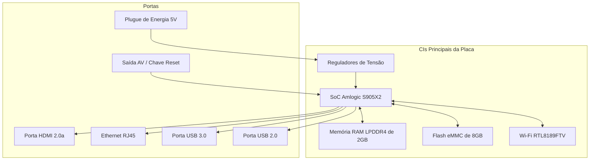

# Referência Técnica - BTV E10

---

## Visão Geral

### Descrição do Dispositivo
O **BTV E10** (frequentemente chamado de BTV E10 Express) é uma TV Box comercial Android fabricada pela BTV. Foi originalmente distribuído como um receptor de entretenimento para canais de streaming, mídia e aplicativos de jogos.

### Mercado Alvo
Voltado principalmente para o mercado de streaming de mídia e entretenimento de consumo na América Latina, especialmente no Brasil. Devido à obsolescência do hardware ou descontinuação do suporte de serviços, milhares desses dispositivos são atualmente descartados ou apreendidos, tornando-se excelentes candidatos para reciclagem de hardware e conversão em nós de servidores de borda.

### Status Atual de Hardware Conhecido
O BTV E10 é construído sobre uma arquitetura estável e robusta baseada em Amlogic G12A. A configuração padrão de fábrica apresenta um processador quad-core, um processador gráfico dedicado, armazenamento eMMC e periféricos de conectividade padrão (USB 2.0, USB 3.0, Fast Ethernet).

### Status de Suporte MultiForge
* **Status**: 🟢 Totalmente Suportado (a partir do MVP da Fase 1)
* **Arquitetura Alvo**: `arm64` (ARMv8-A)
* **Imagem Principal**: ForgeOS / Armbian (kernel customizado `6.1.y`)
* **Perfil de Implantação**: Servidor Headless, IoT Gateway ou Estação de Mídia (Kodi)

---

## Especificações Rápidas

| Item | Valor | Confiança |
|------|-------|------------|
| Fabricante | BTV | 🟢 Confirmado |
| Modelo | E10 / E10 Express | 🟢 Confirmado |
| Placa | BTVE E10-LPDDR4 V.10 201-03-08 | 🟢 Confirmado |
| SoC | Amlogic S905X2 (Alternativa: Rockchip RK3566) | 🟢 Confirmado (S905X2) / 🔴 Não Verificado (RK3566) |
| CPU | Quad-core ARM Cortex-A53 (100 MHz - 1.8 GHz) | 🟢 Confirmado |
| GPU | ARM Mali-G31 MC1 | 🟢 Confirmado |
| RAM | 2GB LPDDR4 | 🟢 Confirmado |
| Armazenamento | 8GB eMMC | 🟢 Confirmado |
| Wi-Fi | Realtek RTL8189FTV (802.11b/g/n, SDIO) | 🟢 Confirmado |
| Bluetooth | Nenhum (RTL8189FTV é apenas Wi-Fi) | 🟢 Confirmado |
| Ethernet | 10/100 Mbps (Fast Ethernet, RJ45) | 🟢 Confirmado |
| HDMI | HDMI 2.0a (até 4K @ 60Hz) | 🟢 Confirmado |
| USB | 1x USB 3.0 (Tipo-A, Azul), 1x USB 2.0 (Tipo-A, Preto) | 🟢 Confirmado |
| Alimentação | Entrada DC 5V / 2A (conector barril) | 🟢 Confirmado |

---

## Hardware

### Layout da Placa e Principais CIs
O BTV E10 apresenta um design de placa única com a designação do modelo `BTVE E10-LPDDR4 V.10 201-03-08` impressa na superfície da placa.



### Circuitos Integrados (CIs)
* **SoC**: **Amlogic S905X2** 🟢 Confirmado. Contém uma CPU ARM Cortex-A53 quad-core e uma GPU ARM Mali-G31 MC1.
* **RAM**: **2GB LPDDR4** 🟢 Confirmado. Geralmente implementado através de dois chips de memória LPDDR4 posicionados adjacentes ao SoC.
* **Armazenamento**: **8GB eMMC 5.1** 🟢 Confirmado. Um chip de memória flash eMMC padrão é soldado à placa.
* **Wi-Fi**: **Realtek RTL8189FTV** 🟢 Confirmado. Operando sobre a interface SDIO.
* **Bluetooth**: 🟢 Confirmado como **Não Presente** no módulo (o chip RTL8189FTV é estritamente Wi-Fi 2.4GHz 802.11n).
* **Ethernet**: Transceptor de camada física (PHY) integrado no SoC Amlogic, suportando taxas de 10/100 Mbps 🟢 Confirmado.
* **Portas USB**: Uma porta USB 3.0 azul e uma porta USB 2.0 preta 🟢 Confirmado.
* **Reguladores**: PMU integrado fornecendo linhas de alimentação de 1.2V (SoC Core), 1.8V (LPDDR4/eMMC I/O), 3.3V (Wi-Fi/Sistema) e 5.0V 🟢 Confirmado.
* **LEDs**: Barra de LED frontal indicando o estado de energia (Azul: Ativo, Vermelho: Standby) 🟢 Confirmado.
* **Botões**: Uma chave táctil de reset física montada dentro do conector AV de 3.5mm 🟢 Confirmado.
* **Resfriamento**: Um dissipador de alumínio passivo acoplado sobre o SoC por meio de um elastômero térmico (thermal pad) 🟢 Confirmado.
* **Console UART**: Pontos de depuração TX, RX e GND expostos na superfície da placa (geralmente sem pinos soldados) 🟢 Confirmado.

---

## Software

### Firmware de Fábrica
O BTV E10 padrão vem com uma versão customizada proprietária do sistema Android TV:
* **Versão do Android**: Android 9.0 (Pie) 🟢 Confirmado.
* **Bootloader**: U-Boot proprietário otimizado para Amlogic G12A.
* **Layout de Partições**: Layout de partições padrão da Amlogic (`bootloader`, `logo`, `boot`, `system`, `recovery`, `data`, `cache`).
* **Modo de Recuperação**: Imagem de recuperação do Android acessível através do botão de reset durante a inicialização.
* **Atualizações OTA**: Entregues através do aplicativo de atualização proprietário da BTV.
* **Device Tree**: O Android de fábrica utiliza uma DTB compilada do perfil de placa `g12a_u212_2g`.

---

## Suporte Linux

### Compatibilidade de Distribuições

| Distribuição | Status | Alvo DTB | Notas |
|--------------|--------|----------|-------|
| **ForgeOS** | 🟢 Suportado | `meson-g12a-sei510.dtb` | Recomendado. Funciona sem configurações adicionais. |
| **Armbian** | 🟢 Suportado | `meson-g12a-sei510.dtb` | Requer configuração manual de scripts. |
| **Debian** | 🟡 Provável | `meson-g12a-sei510.dtb` | Funciona com kernel contendo patches do fabricante. |
| **Ubuntu** | 🟡 Provável | `meson-g12a-sei510.dtb` | Funciona com kernel contendo patches do fabricante. |

### Matriz de Recursos

| Recurso | Status | Notas |
|---------|--------|-------|
| **HDMI** | 🟢 Funcionando | Vídeo e áudio sobre HDMI funcionam usando drivers padrão. |
| **Ethernet** | 🟢 Funcionando | Negociação automática de 10/100 Mbps estável. |
| **Wi-Fi** | 🟢 Funcionando | Driver do RTL8189FTV compilado fora da árvore ou disponível no kernel customizado. |
| **Bluetooth**| 🔴 Não Suportado | O hardware não possui chip de Bluetooth integrado. |
| **USB** | 🟢 Funcionando | Ambas as portas USB 2.0 e USB 3.0 estão operacionais. |
| **Áudio** | 🟢 Funcionando | Áudio via HDMI funciona. Áudio estéreo do conector AV é 🟡 Provável, mas não testado. |
| **GPU** | 🟢 Funcionando | O driver Mali Panfrost funciona para aceleração 3D. |
| **Decodificação de Vídeo** | 🟡 Provável | Decodificação de hardware funciona em builds customizadas (Kodi), suporte limitado no mainline. |
| **eMMC** | 🟢 Funcionando | Alta estabilidade em leituras/escritas do armazenamento. |
| **Cartão SD** | 🟢 Funcionando | Boot secundário e expansão de armazenamento ativos. |

---

## Gravação de Sistema (Flashing)

### Método 1: Inicialização via Cartão SD / Pendrive (Recomendado para Instalação)
* **Requisitos**: Pendrive ou cartão MicroSD (mínimo de 8GB), BalenaEtcher/Rufus, scripts customizados (`aml_autoscript`, `s905_autoscript`).
* **Procedimento**:
  1. Grave a imagem (ex: `Armbian-S905x2-BTV-DOACAO-2023.img`) usando o BalenaEtcher.
  2. Coloque os scripts `aml_autoscript` e `s905_autoscript` na raiz da partição de boot.
  3. Copie o arquivo `meson-g12a-sei510.dtb` para a pasta `/dtb/amlogic/`.
  4. Mantenha pressionado o botão de reset (dentro da entrada AV) com um clipe/palito e ligue o aparelho na tomada.
* **Risco**: Extremamente baixo. Não sobrescreve o eMMC interno a menos que o comando de instalação seja explicitamente executado.
* **Status de Suporte**: 🟢 Totalmente Operacional.

### Método 2: Conversão via Script U-Boot para eMMC
* **Requisitos**: Inicialização bem-sucedida via USB/SD Card externo, script `/root/install-aml.sh` no sistema.
* **Procedimento**:
  1. Inicialize o sistema live.
  2. Execute o script `\root\install-aml.sh` (ou `install-aml.sh`).
  3. Altere o UUID do dispositivo de boot em `armbianEnv.txt` para apontar para a nova partição `BOOT_EMMC`.
* **Risco**: Alto. Sobrescreve o sistema Android de fábrica. Pode causar soft-brick se interrompido.
* **Status de Suporte**: 🟢 Suportado.

### Método 3: USB Burning Tool (Recuperação)
* **Requisitos**: PC com Windows, software Amlogic USB Burning Tool (v2.x ou v3.x), cabo USB macho-macho conectado à porta USB 2.0 da TV Box.
* **Procedimento**:
  1. Carregue o firmware original `.img` no software.
  2. Pressione o botão de reset interno da porta AV e conecte o cabo USB ao computador.
  3. Inicie o processo de flashing.
* **Risco**: Moderado.
* **Status de Suporte**: 🟢 Suportado.

---

## Recuperação (Recovery)

### Recuperação de Soft-Brick
Se o dispositivo falhar na inicialização, mas demonstrar atividade (LEDs acesos, saída serial), ele pode ser recuperado regravando a imagem Android de fábrica usando o **Amlogic USB Burning Tool** com cabo USB macho-macho.

### Recuperação de Hard-Brick (Modo MaskROM)
Se o bootloader estiver completamente corrompido:
1. Abra a carcaça para expor a placa.
2. Localize os pontos de teste de clock do eMMC (CLK) e terra (GND) na placa.
3. Faça um curto-circuito temporário entre estes dois pontos com uma pinça ao conectar o cabo de energia/cabo USB.
4. O dispositivo será reconhecido pelo PC como um dispositivo USB genérico da Amlogic, permitindo carregar um novo U-Boot.

---

## Análise de Desmontagem (Teardown)

### Vídeo de Referência
A desmontagem principal e o procedimento de conversão de software baseiam-se no vídeo produzido pelo Instituto Federal de São Paulo (IFSP): [Procedimento para conversão TVBox BTV](https://www.youtube.com/watch?v=xAo_zRkePls).

### Layout Interno e Carcaça
* **Carcaça**: Construída em plástico ABS e fixada por travas plásticas de pressão. Não há parafusos externos fixando a tampa superior à inferior.
* **Abertura**: Requer uma espátula plástica ou palheta inserida no vão entre as tampas para desencaixar os clipes de retenção.
* **Sistema Térmico**: Um pequeno radiador de alumínio passivo fica posicionado sobre o SoC Amlogic. Um thermal pad preenche o espaço entre o chip e o dissipador.
* **Observações de Engenharia**: A placa apresenta um layout limpo, com chips dedicados de proteção contra surtos estáticos (ESD) ao redor da porta HDMI. O botão de reset fica oculto no fundo do conector AV de 3.5mm, exigindo um palito de madeira/plástico para acionamento.

---

## Problemas Conhecidos

> [!WARNING]
> **Incompatibilidade do Amlogic com o armbian-install**:
> O script padrão do Armbian `armbian-install` é incompatível com processadores Amlogic (incluindo o S905X2 do BTV E10). Tentar executá-lo corrompe a tabela de partições interna. Deve-se obrigatoriamente utilizar o script `install-aml.sh` para gravação no eMMC.

> [!IMPORTANT]
> **Ausência de Bluetooth Integrado**:
> O chip de Wi-Fi RTL8189FTV não possui controlador Bluetooth. Caso periféricos Bluetooth sejam necessários, deve-se conectar adaptadores USB Bluetooth externos.

---

## Notas do MultiForge

### Representação no ForgeDB
* **Verificação de SoC**: A configuração principal deve apontar para o **Amlogic S905X2** com alto nível de confiança. O registro de Rockchip RK3566 em versões anteriores da planilha é um conflito e deve ser considerado como incorreto ou não verificado para o BTV E10.
* **DTB Padrão**: O dispositivo deve ser configurado com o parâmetro `fdtfile=amlogic/meson-g12a-sei510.dtb`.
* **Perfil de Autodetecção**:
  ```yaml
  detection:
    cpu_info: "Amlogic"
    hardware: "g12a"
    revision: "BTVE E10-LPDDR4 V.10"
  ```

---

## Referências

### Primárias
* IFSP Campus Sorocaba - Vídeo tutorial de desmontagem e conversão: [Procedimento para conversão TVBox BTV](https://www.youtube.com/watch?v=xAo_zRkePls).

### Documentação Oficial
* Datasheet e manual de hardware do Amlogic S905X2.
* Especificações técnicas do módulo SDIO Realtek RTL8189FTV.

### Documentação do Linux
* Definições de Device Tree do Linux Mainline para o SoC Amlogic G12A: [kernel.org](https://git.kernel.org/pub/scm/linux/kernel/git/torvalds/linux.git/tree/Documentation/devicetree/bindings/arm/amlogic.yaml).

### Recursos da Comunidade
* Repositório Educabox (fonte de dados e referências de hardware para o BTV E10): [github.com/educabox/educabox](https://github.com/educabox/educabox).
* Tópicos do fórum Armbian sobre dispositivos S905X2.
