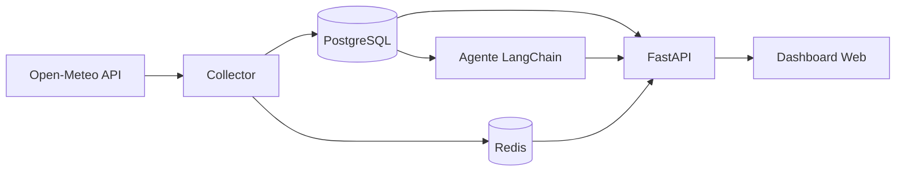

# Assistente Acadêmico Local

Sistema completo de assistente acadêmico baseado em IA para **Linux (Ubuntu 24.04+)**, com coleta de dados em tempo real, persistência em PostgreSQL, cache Redis, API FastAPI, agente LangChain com RAG e dashboard web.

> **Nota:** Os dados da API [Open-Meteo](https://open-meteo.com) simulam *horários e eventos acadêmicos* (temperatura, vento, umidade e horário de atualização).

## Arquitetura

```
Scraping4Hackathon/
├── collector/          # Coleta assíncrona (aiohttp)
│   ├── base.py           # Interface abstrata (API / scraper / portal)
│   ├── open_meteo.py     # Implementação atual
│   ├── university_api.py # Stub para APIs universitárias
│   ├── university_portal.py # Stub Playwright
│   └── scheduler.py      # Loop a cada 30s
├── database/           # PostgreSQL + SQLAlchemy
├── api/                # FastAPI + rotas REST
├── agent/              # LangChain + RAG
├── frontend/           # Dashboard HTML/CSS/JS
├── docker/             # Dockerfiles
├── config/             # Settings (pydantic-settings)
├── shared/             # Cache Redis, logging
├── tests/              # pytest
└── scripts/            # install_linux.sh
```



## Requisitos

- Ubuntu 24.04 ou derivado
- Python 3.12
- Docker e Docker Compose v2
- 2 GB RAM mínimo

## Instalação rápida (Linux)

```bash
git clone <seu-repositorio>
cd Scraping4Hackathon
chmod +x scripts/install_linux.sh
./scripts/install_linux.sh
```

## Instalação manual

```bash
# 1. Clonar e configurar
cp .env.example .env

# 2. Subir infraestrutura
docker compose up -d --build

# 3. Verificar logs
docker compose logs -f collector
docker compose logs -f api
```

Acesse:

| Recurso | URL |
|---------|-----|
| Dashboard | http://localhost:8000 |
| Swagger UI | http://localhost:8000/docs |
| Status | http://localhost:8000/status |

## Endpoints da API

| Método | Rota | Descrição |
|--------|------|-----------|
| GET | `/status` | Status do coletor, banco e cache |
| GET | `/dados-atuais` | Dados mais recentes |
| GET | `/historico?limit=50&offset=0` | Histórico paginado |
| GET | `/ultimas-atualizacoes?hours=2` | Registros das últimas N horas |
| POST | `/agente/perguntar` | Pergunta em linguagem natural |

Exemplo:

```bash
curl http://localhost:8000/dados-atuais

curl -X POST http://localhost:8000/agente/perguntar \
  -H "Content-Type: application/json" \
  -d '{"pergunta": "Qual foi a última atualização?"}'
```

## Agente de IA (LangChain)

Configure no `.env`:

```env
# Modo mock (padrão) — respostas determinísticas sem LLM externo
LLM_PROVIDER=mock

# Ollama local
LLM_PROVIDER=ollama
OLLAMA_BASE_URL=http://localhost:11434
OLLAMA_MODEL=llama3.2

# OpenAI
LLM_PROVIDER=openai
OPENAI_API_KEY=sk-...
OPENAI_MODEL=gpt-4o-mini
```

Exemplos de perguntas:

- *Qual foi a temperatura mais alta hoje?*
- *Qual foi a última atualização?*
- *Mostre os dados das últimas 2 horas.*

## Desenvolvimento local (sem Docker)

```bash
python3.12 -m venv .venv
source .venv/bin/activate
pip install -r requirements.txt
cp .env.example .env

# Ajuste POSTGRES_HOST=localhost e REDIS_HOST=localhost no .env
# Suba apenas postgres e redis:
docker compose up -d postgres redis

# Terminal 1 — API
uvicorn api.main:app --reload

# Terminal 2 — Coletor
python -m collector.main
```

## Testes

```bash
source .venv/bin/activate
pip install -r requirements.txt
pytest -v --cov=collector --cov=database --cov=api --cov=agent
```

## Substituir Open-Meteo por fonte universitária

1. Implemente `AcademicDataSource` em `collector/university_api.py` ou `collector/university_portal.py`.
2. Altere `collector/main.py`:

```python
# De:
data_source = OpenMeteoSource(...)

# Para:
from collector.university_api import UniversityApiSource
data_source = UniversityApiSource(base_url="...", api_key="...")
```

A interface `AcademicDataSource` garante que métricas, histórico, RAG e dashboard continuem funcionando.

## Variáveis de ambiente

Consulte `.env.example` para a lista completa. Principais:

| Variável | Default | Descrição |
|----------|---------|-----------|
| `COLLECTOR_INTERVAL_SECONDS` | 30 | Intervalo de coleta |
| `COLLECTOR_LATITUDE` | -23.5505 | Latitude do campus |
| `COLLECTOR_LONGITUDE` | -46.6333 | Longitude do campus |
| `POSTGRES_*` | — | Conexão PostgreSQL |
| `REDIS_*` | — | Conexão Redis |
| `LLM_PROVIDER` | mock | Provedor do agente IA |

## Licença

MIT
