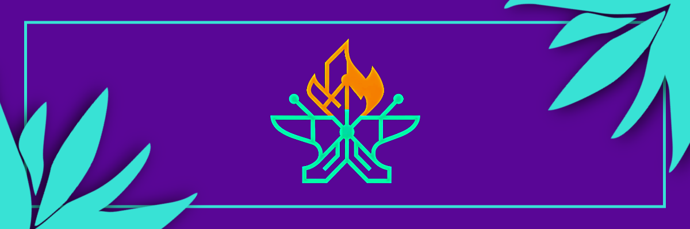

# 🛠️ MultiForge

<p align="center">
  
</p>

Plataforma open-source para identificação, compatibilização, provisionamento e modularização de hardware reaproveitado (TV Boxes e dispositivos ARM legados).

---

## 🗺️ Project Overview

O MultiForge transforma hardware reaproveitado (como TV Boxes descaracterizadas ou apreendidas) em equipamentos úteis (servidores de borda, gateways IoT, media centers ou nós de inteligência de borda). O foco é simplificar o processo de instalação e reduzir as complexidades de compatibilidade de placas e drivers no ecossistema ARM.

---

## 🎯 Goals

* **Reaproveitamento de Hardware**: Dar vida útil a milhares de TV Boxes legadas e SBCs, combatendo o lixo eletrônico.
* **Redução da Complexidade**: Automatizar a detecção de SoC, WiFi e periféricos.
* **Provisionamento Inteligente**: Permitir a instalação guiada e parametrização pós-gravação rápida e robusta.
* **Modularidade**: Prover um catálogo de serviços plug-and-play para rodar sobre a imagem de sistema base.

---

## ⚙️ Repository Architecture

O repositório está organizado de forma a separar claramente a documentação do projeto, a base de conhecimento de hardware, o ecossistema de módulos e os componentes de software.

```text
multi-forge/
├── .github/            # Workflows de CI/CD e templates do GitHub
├── docs/               # Documentação técnica detalhada e roadmap
├── ForgeDB/            # Banco de compatibilidade e metadados de hardware
├── ForgeHub/           # Repositório/marketplace e runtime dos módulos
├── ForgeOS/            # Camada mínima de sistema operacional
├── ForgeImager/        # Ferramenta gráfica baseada em Qt6/C++ para gravação
└── ForgeModules/       # Aplicações e perfis funcionais (ex: Totem)
```

---

## 📦 Components

1. **ForgeDB**: Banco de metadados de hardware organizados de forma simples em arquivos YAML. Mapeia SoCs, WiFi, memórias e problemas conhecidos por dispositivo (dispositivo piloto: **BTV E10**).
2. **ForgeHub**: Catálogo descentralizado de módulos categorizados por níveis de origem/confiança (`Official`, `Verified`, `Community`, `Private`).
3. **ForgeOS**: Imagem operacional enxuta contendo kernel, DTB, drivers e runtimes auxiliares (CLI, Agent e Provisioner).
4. **ForgeImager**: Software gravador de mídia (baseado em Qt6) que injeta o arquivo descritivo de provisionamento `forge.yaml` no primeiro boot do dispositivo.
5. **ForgeModules**: Coleção de serviços e configurações declarativas empacotadas para o ecossistema MultiForge.

---

## 🗺️ Roadmap

Consulte a documentação do [Roadmap](docs/roadmap.md) para ver o detalhamento completo de cada fase:
* **Phase 1 — Hackathon MVP**: Prova de conceito funcional para BTV E10 e injeção do arquivo `forge.yaml` via ForgeImager.
* **Phase 2 — Community**: Expansão do Forge Agent e suporte a novos SoCs e barramentos.
* **Phase 3 — Production Ecosystem**: Expansão comercial, atualizações OTA (Over-the-Air) e marketplace web consolidado.

---

## 🤝 Contributing

Para contribuir com o projeto, confira os guias em [CONTRIBUTING.md](CONTRIBUTING.md). Toda contribuição de novos módulos, correção de bugs ou catalogação de dispositivos é bem-vinda!

---

## 📜 License

Este projeto está distribuído sob a licença **MIT**. Veja o arquivo [LICENSE](LICENSE) para mais detalhes.
