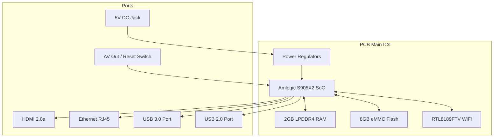

# BTV E10 Technical Reference

---

## Overview

### Device Description
The **BTV E10** (often referred to as BTV E10 Express) is a commercial Android TV Box manufactured by BTV. It was originally distributed as an entertainment receiver for streaming channels, media, and gaming applications.

### Intended Market
Primarily targeted at the consumer entertainment and media streaming market in Latin America, especially Brazil. Due to hardware obsolescence or service desupport, thousands of these devices are currently discarded, decommissioned, or seized, making them excellent candidates for hardware recycling and conversion into server edge nodes.

### Current Known Hardware Status
The BTV E10 is built on a stable, robust Amlogic G12A-based architecture. The default factory configuration features a quad-core processor, a dedicated graphics processor, eMMC storage, and standard connectivity peripherals (USB 2.0, USB 3.0, Fast Ethernet).

### MultiForge Support Status
* **Status**: 🟢 Fully Supported (as of Phase 1 MVP)
* **Target Architecture**: `arm64` (ARMv8-A)
* **Primary Image**: Educabox / Armbian (customized kernel `6.1.y`)
* **Deployment Profile**: Headless Server, IoT Gateway, or Media Station (Kodi)

---

## Quick Specifications

| Item | Value | Confidence |
|------|-------|------------|
| Manufacturer | BTV | 🟢 Confirmed |
| Model | E10 / E10 Express | 🟢 Confirmed |
| Board | BTVE E10-LPDDR4 V.10 201-03-08 | 🟢 Confirmed |
| SoC | Amlogic S905X2 (Alternative: Rockchip RK3566) | 🟢 Confirmed (S905X2) / 🔴 Unverified (RK3566) |
| CPU | Quad-core ARM Cortex-A53 (100 MHz - 1.8 GHz) | 🟢 Confirmed |
| GPU | ARM Mali-G31 MC1 | 🟢 Confirmed |
| RAM | 2GB LPDDR4 | 🟢 Confirmed |
| Storage | 8GB eMMC | 🟢 Confirmed |
| Wi-Fi | Realtek RTL8189FTV (802.11b/g/n, SDIO) | 🟢 Confirmed |
| Bluetooth | None (RTL8189FTV is Wi-Fi only) | 🟢 Confirmed |
| Ethernet | 10/100 Mbps (Fast Ethernet, RJ45) | 🟢 Confirmed |
| HDMI | HDMI 2.0a (up to 4K @ 60Hz) | 🟢 Confirmed |
| USB | 1x USB 3.0 (Type-A, Blue), 1x USB 2.0 (Type-A, Black) | 🟢 Confirmed |
| Power | 5V / 2A DC input (barrel connector) | 🟢 Confirmed |

---

## Hardware

### PCB Layout and Main ICs
The BTV E10 features a single-board design with the model designation `BTVE E10-LPDDR4 V.10 201-03-08` silk-screened on the PCB surface. 



### Integrated Circuits (ICs)
* **SoC**: **Amlogic S905X2** 🟢 Confirmed. It contains a quad-core ARM Cortex-A53 CPU and an ARM Mali-G31 MC1 GPU.
* **RAM**: **2GB LPDDR4** 🟢 Confirmed. Typically implemented via twin LPDDR4 memory ICs positioned adjacent to the SoC.
* **Storage**: **8GB eMMC 5.1** 🟢 Confirmed. A standard eMMC flash memory chip is soldered to the board.
* **Wi-Fi**: **Realtek RTL8189FTV** 🟢 Confirmed. Operating over the SDIO interface.
* **Bluetooth**: 🟢 Confirmed as **Not Present** on the module (RTL8189FTV chip is strictly Wi-Fi 2.4GHz 802.11n).
* **Ethernet**: Integrated physical layer transceiver (PHY) in the Amlogic SoC supporting 10/100 Mbps rates 🟢 Confirmed.
* **USB Ports**: One blue USB 3.0 port and one black USB 2.0 port 🟢 Confirmed.
* **Regulators**: Integrated PMU providing 1.2V (SoC Core), 1.8V (LPDDR4/eMMC I/O), 3.3V (Wi-Fi/System), and 5.0V power rails 🟢 Confirmed.
* **LEDs**: Front-facing status LED bar indicating power state (Blue: Active, Red: Standby) 🟢 Confirmed.
* **Buttons**: A physical tactile reset switch mounted inside the 3.5mm AV jack enclosure 🟢 Confirmed.
* **Cooling**: A passive aluminum heatsink attached to the top of the SoC via a thermal pad 🟢 Confirmed.
* **UART Console**: Exposed TX, RX, GND debug pads on the PCB surface (normally unpopulated) 🟢 Confirmed.

---

## Software

### Factory Firmware
The stock BTV E10 ships with a customized proprietary Android TV build:
* **Android Version**: Android 9.0 (Pie) 🟢 Confirmed.
* **Bootloader**: Proprietary U-Boot build optimized for Amlogic G12A.
* **Partition Layout**: Standard Amlogic partition layout (`bootloader`, `logo`, `boot`, `system`, `recovery`, `data`, `cache`).
* **Recovery Mode**: Android recovery image accessible via reset button during startup.
* **OTA Updates**: Delivered through BTV's proprietary system update app.
* **Device Tree**: Factory Android uses a DTB compiled from the `g12a_u212_2g` board profile.

---

## Linux Support

### Distribution Compatibility

| Distribution | Status | DTB Target | Notes |
|--------------|--------|------------|-------|
| **Educabox** | 🟢 Supported | `meson-g12a-sei510.dtb` | Recommended. Works out-of-the-box. |
| **Armbian** | 🟢 Supported | `meson-g12a-sei510.dtb` | Requires manual configuration of scripts. |
| **Debian** | 🟡 Likely | `meson-g12a-sei510.dtb` | Working with vendor-patched kernel. |
| **Ubuntu** | 🟡 Likely | `meson-g12a-sei510.dtb` | Working with vendor-patched kernel. |

### Feature Matrix

| Feature | Status | Notes |
|---------|--------|-------|
| **HDMI** | 🟢 Working | Video and audio over HDMI work using standard drivers. |
| **Ethernet** | 🟢 Working | 10/100 Mbps auto-negotiation stable. |
| **Wi-Fi** | 🟢 Working | RTL8189FTV driver compiled out-of-tree or available in custom kernel. |
| **Bluetooth**| 🔴 Unsupported | Hardware lacks Bluetooth capabilities. |
| **USB** | 🟢 Working | Both USB 2.0 and USB 3.0 ports operational. |
| **Audio** | 🟢 Working | HDMI audio works. AV jack stereo audio is 🟡 Likely but untested. |
| **GPU** | 🟢 Working | Mali Panfrost driver works for 3D acceleration. |
| **Video Decode** | 🟡 Likely | Hardware decoding works on custom builds (Kodi), limited support on mainline. |
| **eMMC** | 🟢 Working | High stability on storage reads/writes. |
| **SD Card** | 🟢 Working | Secondary boot and storage expansion active. |

---

## Flashing

### Method 1: SD Card / USB Drive Boot (Recommended for Installation)
* **Requirements**: USB Flash Drive or MicroSD card (minimum 8GB), BalenaEtcher/Rufus, customized scripts (`aml_autoscript`, `s905_autoscript`).
* **Procedure**:
  1. Burn the image (e.g. `Armbian-S905x2-BTV-DOACAO-2023.img`) using BalenaEtcher.
  2. Place custom `aml_autoscript` and `s905_autoscript` on the root of the boot partition.
  3. Copy `meson-g12a-sei510.dtb` into `/dtb/amlogic/`.
  4. Hold the reset button (inside the AV jack) with a toothpick/clip and power on the box.
* **Risks**: Extremely low. Does not overwrite the internal eMMC unless explicitly commanded.
* **Support Status**: 🟢 Fully Operational.

### Method 2: U-Boot Script Conversion to eMMC
* **Requirements**: Established boot via external USB/SD Card, target script `/root/install-aml.sh`.
* **Procedure**:
  1. Boot into the live environment.
  2. Run the script `\root\install-aml.sh` (or `install-aml.sh`).
  3. Change the boot target uuid inside `armbianEnv.txt` to point to the new `BOOT_EMMC` partition.
* **Risks**: High. Overwrites the factory Android OS. Can cause soft-bricks if interrupted.
* **Support Status**: 🟢 Supported.

### Method 3: USB Burning Tool (Recovery)
* **Requirements**: Windows PC, Amlogic USB Burning Tool (v2.x or v3.x), male-to-male USB Type-A cable connected to the USB 2.0 port.
* **Procedure**:
  1. Load the factory `.img` firmware inside the software.
  2. Press the reset button inside the AV jack and connect the USB cable.
  3. Start flashing.
* **Risks**: Moderate.
* **Support Status**: 🟢 Supported.

---

## Recovery

### Soft-Brick Recovery
If the device fails to boot but shows life (LED lights, serial output), it can be recovered by flashing the factory Android image via the **Amlogic USB Burning Tool** using a male-to-male USB cable.

### Hard-Brick Recovery (MaskROM Mode)
If the bootloader is completely corrupted, the SoC can be forced into MaskROM mode:
1. Open the casing to expose the PCB.
2. Locate the eMMC clock (CLK) and Ground (GND) test pads on the board.
3. Short-circuit these two pads using tweezers while inserting the power cord/USB cable.
4. The device will report to the host PC as a generic Amlogic USB device, allowing a fresh U-Boot upload.

---

## Teardown Analysis

### Teardown Reference Video
The primary teardown and software conversion documentation is sourced from the academic research video by the Federal Institute of São Paulo (IFSP): [Procedimento para conversão TVBox BTV](https://www.youtube.com/watch?v=xAo_zRkePls).

### Internal Layout and Casing
* **Casing**: Constructed of ABS plastic held together with plastic tabs. There are no external screws holding the top and bottom covers.
* **Opening**: Requires a plastic spudger or guitar pick inserted into the seam between the top and bottom covers to pop the retaining clips.
* **Thermal System**: A small aluminum passive radiator sits on top of the Amlogic SoC. A thermal pad fills the gap between the chip package and the heatsink. 
* **Engineering Observations**: The board uses a relatively clean design with dedicated ESD protection chips around the HDMI port. The reset button is co-located inside the 3.5mm AV port, requiring a non-conductive toothpick or plastic pin to actuate.

---

## Known Issues

> [!WARNING]
> **Amlogic Incompatibility with armbian-install**: 
> Standard Armbian configurations rely on the `armbian-install` script to flash images to internal storage. However, TV Boxes with Amlogic SoCs (including the S905X2 inside the BTV E10) **are incompatible** with this script. Attempting to run it will corrupt the partition table. Instead, users **must** utilize the specialized `install-aml.sh` script.

> [!IMPORTANT]
> **No Built-in Bluetooth**: 
> The Wi-Fi chip (RTL8189FTV) does not contain a Bluetooth controller. USB Bluetooth dongles must be used if Bluetooth peripherals are required.

---

## MultiForge Notes

### Representation in ForgeDB
* **SoC Verification**: Mainline config must target **Amlogic S905X2** with high confidence. The Rockchip RK3566 entry found in older catalog indexes is a conflict and should be treated as an unverified/incorrect specification for the BTV E10.
* **Default DTB Config**: The device must be provisioned with `fdtfile=amlogic/meson-g12a-sei510.dtb` in the configuration files.
* **Auto-Detection Profile**:
  ```yaml
  detection:
    cpu_info: "Amlogic"
    hardware: "g12a"
    revision: "BTVE E10-LPDDR4 V.10"
  ```

---

## References

### Primary
* IFSP Campus Sorocaba - Teardown and Conversion Tutorial Video: [Procedimento para conversão TVBox BTV](https://www.youtube.com/watch?v=xAo_zRkePls).

### Official Documentation
* Amlogic S905X2 Datasheet and Hardware Manual.
* Realtek RTL8189FTV SDIO Module Specification.

### Linux Documentation
* Mainline Linux Kernel Device Tree bindings for Amlogic G12A: [kernel.org](https://git.kernel.org/pub/scm/linux/kernel/git/torvalds/linux.git/tree/Documentation/devicetree/bindings/arm/amlogic.yaml).

### Community Resources
* Educabox project repository: [github.com/educabox/educabox](https://github.com/educabox/educabox).
* Armbian TV Box forum threads for S905X2 devices.
